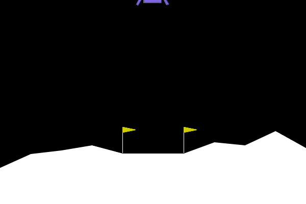
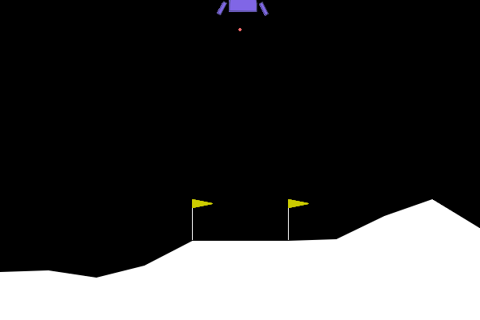
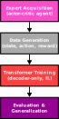

# Learning to Land: Imitation Learning with a Decoder-Only Transformer

This project explores how a **decoder-only Transformer** can learn to control the [Gymnasium Lunar Lander](https://gymnasium.farama.org/environments/box2d/lunar_lander/) environment purely through **imitation learning** (IL) from an expert trained with Actor–Critic reinforcement learning (RL).

The trained Transformer is able to **land the spacecraft successfully**, and even **generalizes** when the environment physics (e.g., gravity) are modified!

<p align="center">
  <figure style="display: inline-block; margin: 0 100px; text-align: center;">
    
    <figcaption>Expert Pilot</figcaption>
  </figure>
  <figure style="display: inline-block; margin: 0 5px; text-align: center;">
    
    <figcaption>Transformer Pilot</figcaption>
  </figure>
</p>

## Motivation

Reinforcement learning agents are often **sample-inefficient** and **sensitive to environment changes**. Here, I investigate whether a Transformer trained purely from **expert demonstrations** can:
- Achieve competent control performance; and  
- **Generalize** better than the expert when faced with altered physics.

## Approach Overview

The project pipeline consists of four main stages:

### 1. Expert Acquisition :brain:
- A pretrained (on the standard Lunar Lander environment) [actor–critic agent](https://github.com/nikhilbarhate99/Actor-Critic-PyTorch) is used.
- This agent achieves stable landings and serves as the **expert**.

### 2. Data Generation :rocket:
- The expert policy produces 1000 trajectories of `(state, action)` tuples plus the accumulated reward per episode.
- These episodes are padded to get fixed-length episodes, stored and later tokenized into sequences for the Transformer.
- The normalized accumulated rewards are used to weight the losses during training.

### 3. Transformer Training :robot:
- A **decoder-only Transformer** learns to predict the next action given the previous states and actions.
- Coarse search determines reasonable architectural bounds (e.g., depth, heads, embedding dimension).
- **Hyperparameter optimization (HPO)** is then performed using [NNI](https://nni.readthedocs.io/).

### 4. Evaluation & Generalization :video_game:
- The trained model is compared with the expert in:
  - The **original environment**, and  
  - **Altered-gravity** variants (±10%).

<p align="center">
  
</p>

## Results

### Key Insight: Train-Long, Test-Short Improves Robustness

Although the best model was **trained with sequence length = 12**, it achieved **higher returns during deployment** when the inference context was **shortened to 6**.

> **Hypothesis:**  
> Shorter inference contexts act as a *regularizer*, limiting the propagation of compounding errors and reducing the influence of outdated states — mitigating distribution-shift noise common in imitation learning.

This effect parallels known findings in sequence modeling (e.g., *Press et al., 2022; Chen et al., 2021*) but has rarely been examined in control tasks.

## Reproducing the Experiments

```bash
# 1. Generate expert trajectories
bash scripts/generate_expert_data.sh

# 2. Train the Transformer
bash scripts/train_transformer.sh

# 3. Evaluate generalization
bash scripts/evaluate_generalization.sh
```

## Repository Structure

The repository is organized as follows:

```
lunar-transformer-il/
├── configs/               # JSON experiment configs
├── data/
│   ├── raw/               # Expert episodes
│   └── processed/         # Tokenized sequences
│   └── media/             # Images/GIFs and other used for documentation
├── notebooks/             # Analysis & visualization
├── results/
│   ├── models/            # Saved checkpoints (.pth) and evaluation data (.pkl)
│   └── plots/             # Generated figures
├── scripts/               # Bash / CLI entrypoints
└── src/
    ├── data/              # Handles expert data and transformer dataset generation
    ├── evaluation/        # Evaluation & generalization tests
    ├── hpo/               # Coarse architecture search and NNI HPO
    ├── models/            # Transformer & Actor-Critic architectures
    ├── training/          # Training loops & trainer utilities
    └── utils/             # Logging, plotting, config parsers

```

## Contact

I’m always open to discuss deep-learning research or ML engineering opportunities!

:email: [wsoaresgirao@gmail.com](mailto:wsoaresgirao@gmail.com)

:link: [LinkedIn](https://www.linkedin.com/in/williansg/?originalSubdomain=nl)

:computer: [GitHub](https://github.com/Willian-Girao)