# Coarse Architecture Search

A **coarse search** of **network architecture** hyperparameters (e.g., model depth, number of attention heads, embedding size, etc.) was performed to find a **trade-off between model complexity and representational capacity**.

Too complex models (e.g., large hidden layers or high embedding dimensions) can overfit the training data, leading to poor generalization. Conversely, overly simple architectures may fail to capture the underlying task dynamics.

This stage can be considered an **architecture sanity check** — the goal is to verify that the Transformer can learn meaningful control behavior **before** running a more expensive fine-grained hyperparameter optimization (HPO) with NNI.

## Methodology

To determine a suitable model configuration, I tested **increasingly complex network architectures** while varying a small set of key **training hyperparameters**. This provides empirical guidance on the ranges to explore during the final NNI-based HPO.

### Architecture Hyperparameters (increasing complexity)

| Architecture | Depth | Attention Heads | Embedding Dim | Intermediate Dim |
|--------------|--------|------------------|----------------|------------------|
| **A** | 2 | 2 | 32 | 64 |
| **B** | 4 | 4 | 64 | 128 |
| **C** | 6 | 8 | 128 | 256 |

### Training Hyperparameters

| Hyperparameter | Values Tested |
|----------------|----------------|
| Learning Rate | [1e-5, 1e-4, 1e-3] |
| Dropout Probability | [0.1, 0.2, 0.4] |
| Training Sequence Length | [12, 16, 20] |
| Epochs | [25, 50] |

## Architecture A

### Performance Overview
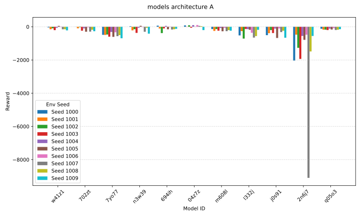

<i>Figure 1: Reward distribution across environment seeds for Architecture A.</i>

<i>Figure 2: Top-3 performing Architecture A models based on mean reward per environment.</i>

### Varying Learning Rate

<i>Figure 3: Training metrics for Architecture A with varying learning rates.</i>

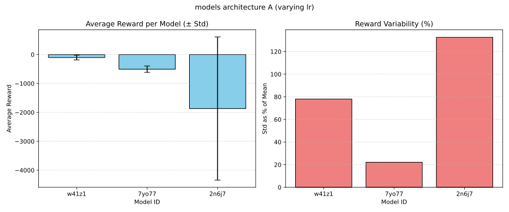

<i>Figure 4: Effect of learning rate on mean and standard deviation of rewards.</i>

### Varying Dropout Probability

<i>Figure 5: Training metrics for Architecture A with different dropout probabilities.</i>

<i>Figure 6: Dropout probability impact on model stability and reward variability.</i>

### Varying Epochs
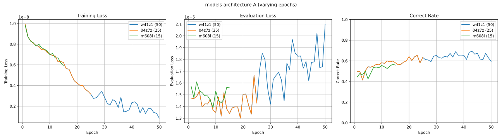

<i>Figure 7: Training curves of Architecture A for different training epochs.</i>

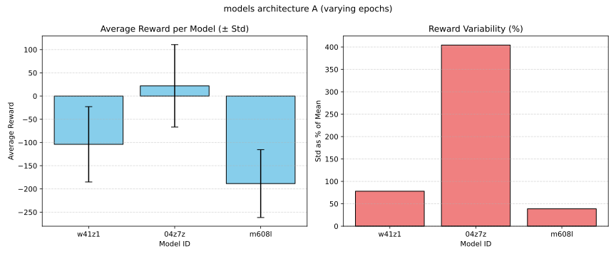

<i>Figure 8: Average reward and variance across epoch counts.</i>

### Varying Sequence Length
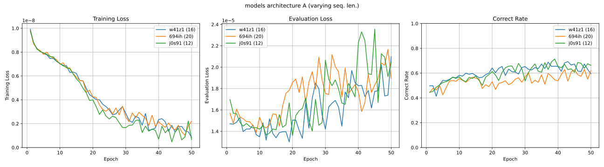

<i>Figure 9: Training performance for different sequence lengths.</i>

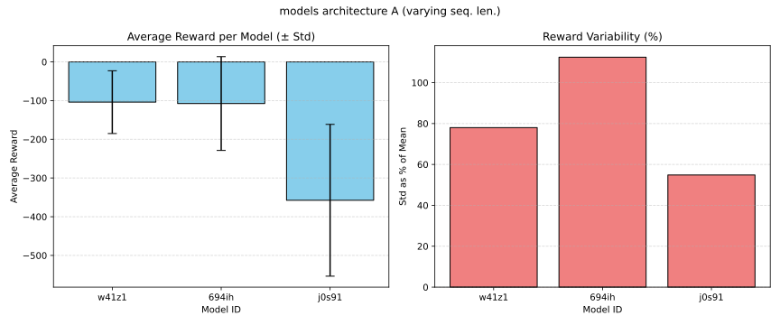

<i>Figure 10: Influence of training sequence length on mean reward and generalization.</i>

> **Summary:** Architecture A achieves **positive rewards** across several models (w41z1, n3w39, 694ih, and 04z7z), some **across several environment seeds**, indicating sufficient representational capacity to capture the task dynamics. Among these, the **top three models share** key hyperparameters: **learning rate = 1e-4**, **dropout = 0.2**, and **sequence length = 16**. Learning rates one order of magnitude higher or lower result in unstable or slow convergence. **Sequence lengths** shorter than 16 or longer than 20 are sub-optimal, suggesting that moderate temporal context benefits learning. **Training beyond 25 epochs** consistently leads to overfitting and degraded generalization. The **best-performing model (04z7z)** uses the configuration **_learning rate = 1e-4, dropout probability = 0.2, sequence lenght = 16, and epochs = 25_** and represents a strong balance between learning speed and stability.

## Architecture B

### Performance Overview
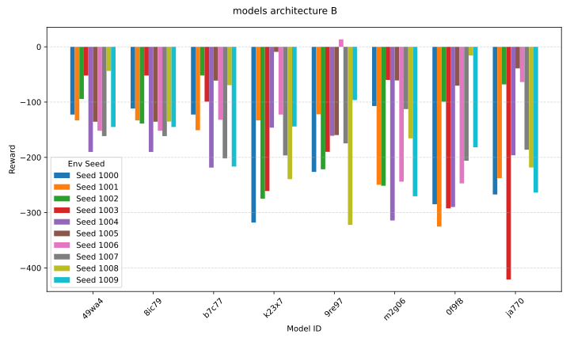

<i>Figure 11: Reward distribution across environment seeds for Architecture B.</i>

<i>Figure 12: Top-3 performing Architecture B models based on mean reward per environment.</i>

### Varying Learning Rate

<i>Figure 13: Training metrics for Architecture B with varying learning rates.</i>

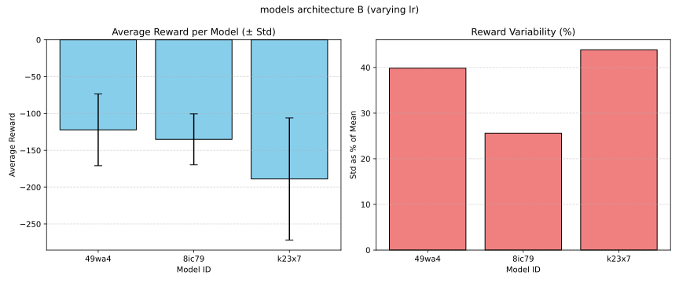

<i>Figure 14: Reward variability under different learning rates.</i>

### Varying Dropout Probability
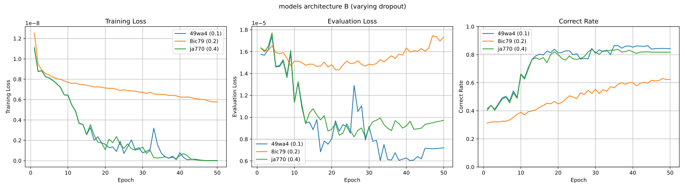

<i>Figure 15: Training metrics for Architecture B with different dropout probabilities.</i>

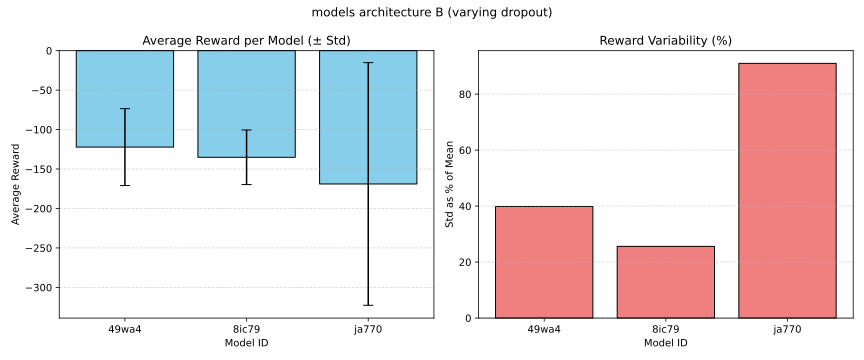

<i>Figure 16: Dropout impact on Architecture B reward stability.</i>

### Varying Epochs
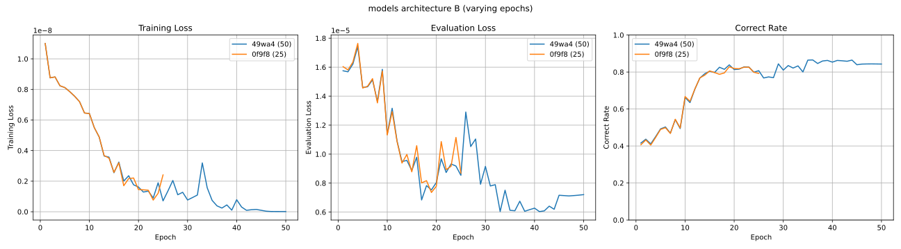

<i>Figure 17: Training progress for Architecture B across different epoch counts.</i>

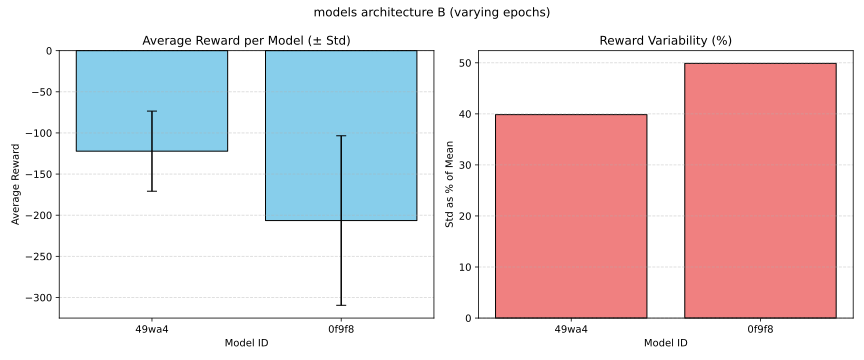

<i>Figure 18: Reward consistency for Architecture B at varying training durations.</i>

### Varying Sequence Length
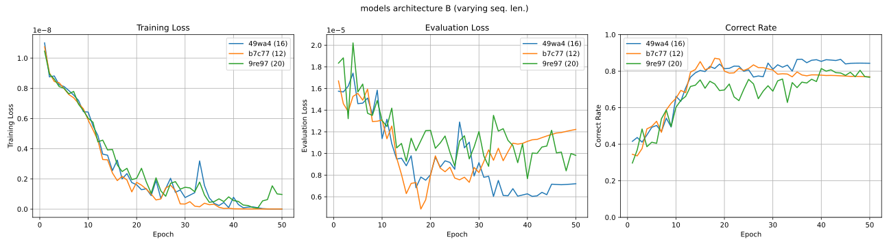

<i>Figure 19: Training metrics for Architecture B with different sequence lengths.</i>

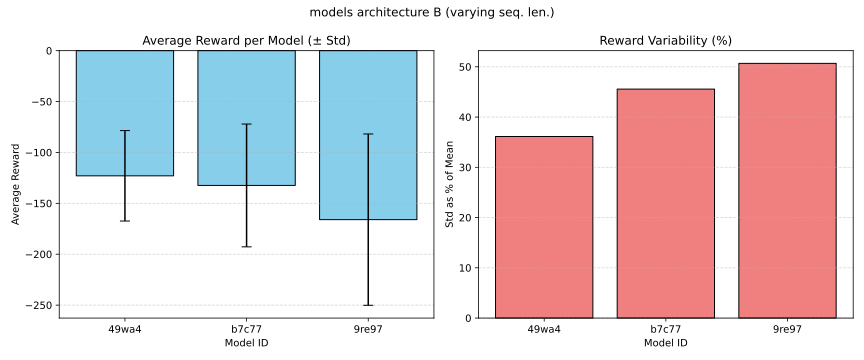

<i>Figure 20: Effect of sequence length on performance and reward variance.</i>

> **Summary:** Architecture B achieves **positive rewards in only two models**, each producing a **single successful run**. While it consistently reaches **lower evaluation loss** and higher **correct rates** than Architecture A, this improvement **does not translate into better task performance**. The model likely **overfits the expert trajectory distribution**, that is, it imitates the expert’s actions more precisely on familiar states but struggles to recover when encountering unseen states during deployment. As in Architecture A, the most stable results occur with **learning rate = 1e-4** and **dropout = 0.2**, while **sequence lengths** around 16 promote better generalization. Similarly to what was observed with Architecture A, learning rates an order of magnitude above or below 1e-4 lead to unstable or slow convergence.

## Architecture C

### Performance Overview

<i>Figure 21: Reward distribution across environment seeds for Architecture C.</i>

<i>Figure 22: Top-3 performing Architecture C models based on mean reward per environment.</i>

### Varying Learning Rate

<i>Figure 23: Training metrics for Architecture C with varying learning rates.</i>

<i>Figure 24: Reward variability across learning rate settings for Architecture C.</i>

### Varying Dropout Probability

<i>Figure 25: Training behavior under different dropout probabilities.</i>

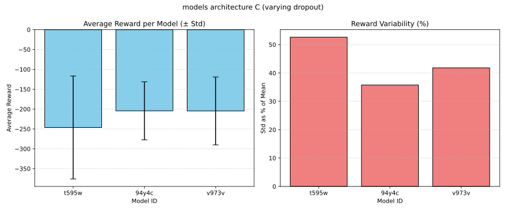

<i>Figure 26: Dropout effects on reward mean and variance.</i>

### Varying Epochs
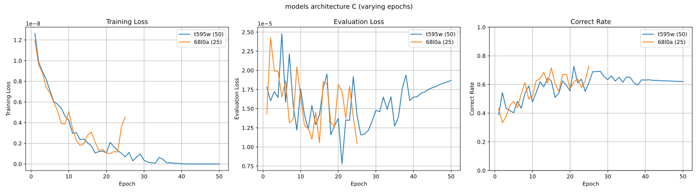

<i>Figure 27: Training performance for Architecture C across epoch counts.</i>

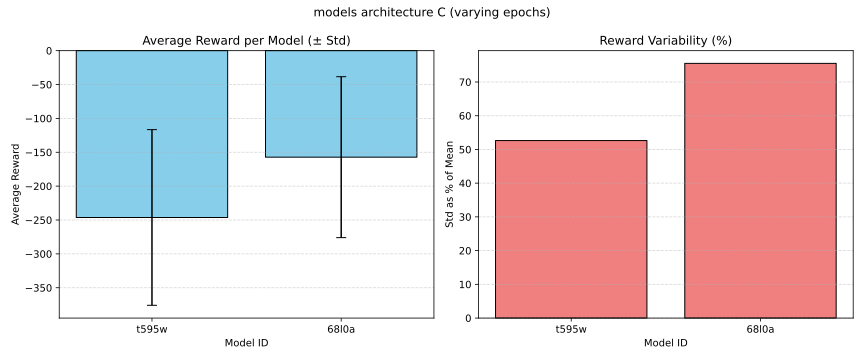

<i>Figure 28: Reward distribution across different training durations.</i>

### Varying Sequence Length

<i>Figure 29: Training results for different sequence lengths.</i>

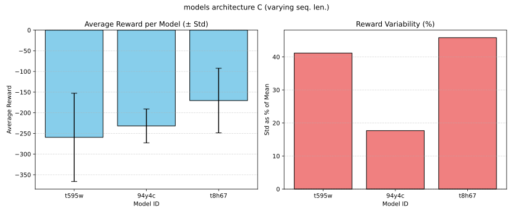

<i>Figure 30: Influence of training sequence length on reward magnitude and consistency.</i>

> **Summary:** Architecture C **fails to achieve any positive-reward episodes**, likely for reasons similar to those observed in Architecture B, that is, **overfitting to the expert trajectory distribution** and limited robustness when acting autonomously. Despite its increased capacity, the model shows **no improvement in control performance**, suggesting that **_further depth and width primarily reinforce memorization_** rather than generalization. Consistent with previous results, the top three models share **learning rate = 1e-4**, **dropout = 0.2**, and **sequence length = 16**, with the best-performing configuration trained for **25 epochs**.

## Observations

### Recurring Values

The recurring values for **learning rate (1e-4)**, **dropout probability (0.2)**, **trining sequence length (16)**, and **training epochs (25)** across architectures provide a solid basis for defining the center points of the hyperparameter search space for the subsequent, fine-grained HPO using NNI.

| Architecture | Learning Rate | Dropout | Seq. Length | Epochs |
|---------------|---------------|----------|--------------|---------|
| **A** | 1e-4 | 0.2 | 16 | 25 |
| **A** | 1e-4 | 0.2 | 16 | 50 |
| **A** | 1e-4 | 0.2 | 20 | 50 |

<i>Table 1: Summary of the top-3 performing model configurations (across architectures) during coarse search, ordered by mean accumulated reward.</i>

### Evaluation vs. Deployment Generalization

Even though Architecture B and C achieves **_lower evaluation loss_** and **_higher correct rate_** on the evaluation data (compared to Architecture A), this data is still _drawn from the same distribution_ as the training one (that is, it contains state–action pairs produced by the expert policy under the same environment dynamics). Because of that, what the lower loss actually shows is that these architectures learned to **imitate the expert’s demonstrated behavior more precisely** within that _same distribution_.

However, at **deployment time**, the model must generate actions _autoregressively_ (each predicted action changes the next state it sees). If the model’s predictions deviate from the expert’s trajectory, it can enter unseen regions of the state space where it has never been trained (because the expert never visited those states), a common problem in immitation learning.

A model that is **_too specialized_** to the training distribution (as are the cases of architectures B and C) will **_collapse in these out-of-distribution states_**, even though it "looked better" offline. That is, the overfitting is not the classical case of poor evaluation accuracy (architectures B and C have higher correct rates than architecture A), it is an **overfitting of the expert's behavior** that leads to **poor generalization during deployment**.

### Missleading High Rewards

Some of the models are able to **achieve low negative rewards by luck**. An example of that can be seen when the lander crashes, whithout having taken any action, close enough to the landing site. Because of that, the more **_fine-grained HPO should consider a metric that is different than the total reward_** of an episode. A candidate could be the **area under the reward curve** during the episode, wich would be more telling of the actual capacity to control the lander.

## Next Steps

The insights gained here informed the **search space design** for the subsequent NNI-based fine-tuning. Architecture **A** is chosen as the baseline configuration for this next phase since it is the one that maximizes positive rewards.

