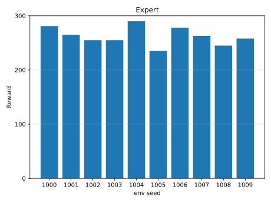
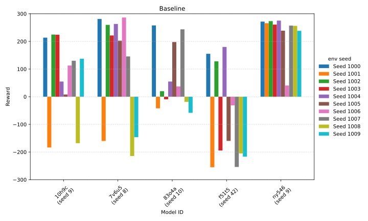
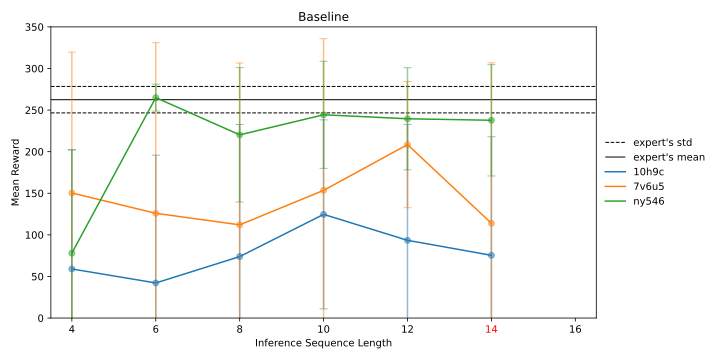

In Figure 1 I show the expert's (accumulated) rewards in environments with different seeds. The seeds for the environment control the initial state of the lander (position, velocity, etc.) and the terrain generation (surface shape, landing pad location, etc). The seeds used for evaluation are in the range [1000, 1009] so that they fall outisde the range of seeds used to generate training data (i.e., the transformer hasn't seen these initial states nor the terrain shapes).

<figure style="display: inline-block; text-align: center;">
  

  
<i>Figure 1: Expert's rewards on environments with different seeds.</i>

</figure>

As expected, the expert is able to land in every environment instance, having a mean accumulated reward of 262.5 and standard deviation of 15.9 — that's a pretty reliable pilot.

In Figure 2 I show the rewards for four instances of the baseline model. Each instance is a transformer trained with the hyperparaneters selected from the HPO with NNI, each using a different random seed for parameters initialization. From the plot we see that the seed used parameter initialization has a huge impact in the final model, which shows how the training of these models is sensitive to their initialization in the parameter space.

<figure style="display: inline-block; text-align: center;">
  

  
<i>Figure 2: Baseline transformer models' (different initialization seeds) rewards on environments with different seeds.</i>

</figure>

The best model (ny546) is able to land the lander in all tested environments without crashing it, although its average reward is ~9% lower than the expert's. The table bellow summarizes the comparison between the expert and the models, showing the average and standar deviation of the rewards across all environment seeds.

| Model | Mean | Std |
|--------------|------------------|----------------|
| **expert** | **262.5** | 15.9 |
| ny546 | 237.7 | 66.9 |
| 7v6u5 | 113.9 |  192.9 |
| 83o4a | 68.2 | 113.4 |
| f51t5 | -85.31 | 168.2 |

The values on the table above are achieved when deploying (i.e., having the models piloting the lander) with a context window (i.e., the length of the state-action sequence the model sees) equal to the one used during training.

Since there is no reason to assume that the optimal context window at deployment is the same as the one used during training, I varied the context window length around the training one in the top two models from above. 

As it can be seen in Figure 3, a shorter context window (relative to the training length) yields better results. It not only improves the average but also considerably reduces the standard deviation (at the optimal length).

<figure style="display: inline-block; text-align: center;">
  

  
<i>Figure 3: Baseline transformers perform better with smaller context window (relative to the training length, shown in red).</i>

</figure>

Model ny546 with (deployment) context window length of 6 performs as well as the expert. This means that the length of the context window needs to be optimized at deployment time — a post-training fine tuning.

| Model | Context Window | Mean | Std |
|--------------|--------------|------------------|----------------|
| expert | -- | 262.5 | 15.9 |
| ny546 | 14 | 237.7 | 66.9 |
| **ny546** | 6 | **264.9** | 16.1 |
| 7v6u5 | 14 | 113.9 |  192.9 |
| 7v6u5 | 12 | 208.4 | 75.8 |

Something that could explaing these results is that shorter inference contexts act as a _**regularizer**_, limiting the propagation of compounding errors and reducing the influence of outdated states — mitigating distribution-shift noise common in imitation learning.