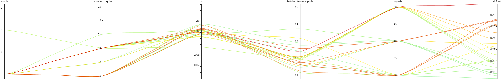

## General Principles for 2nd Round HPO

A second search round should be:

* _Narrower_ around regions where good trials cluster.

* _Wider_ where the relationship is unclear (or possibly multimodal).

* Shifted away from regions that clearly produce poor results.

This means the correct decision on where to focus next depends on the observed patterns from the first round.

  
  
<i>Figure 1: Top 20% trials during NNI HPO.</i>

 Notice that the top 20% performing trials (Figure 1) cluster tightly around certain hyperparameters (e.g., _lr_), whereas for others (e.g., _epochs_) they have a wide variation. This means we should narrow the search range of the former, and maintain (or even widen sligthly) the range of the latter.

 * **depth** - virtually all trials want to use depth = 1, so we'll fix it to 1.
 * **training sequence length** - the trials use sequence lengths ranging from 16 to 10, which is relatively wide. We'll set the new upper range value to 16 and widen the lower range to 6, since there is indication that smaller sequence lengths might be good.
 * **learning rate** (lr) - values span from ~$200\mu$ (0.0002) to ~$2m$ (0.002), and they cluster tightly around 1m. We want to explore around it in a log-symmetric way (since learning rate behaves exponentially, not linearly). In Machine Learning (ML) this is commonly done by setting the bounds of the search space using `lower_bound  = center / sqrt(k)` and `upper_bound  = center * sqrt(k)`, for some factor k (usually 10). We thus fix the new range as lr $\in$ [$3.16\times10^{-4}$, $3.16\times10^{-3}$].
 * **hidden dropout probability** - the majority of the good quality trials span values between ~0.1 and ~0.3, with the top 3 trails sitting between ~0.18 and ~0.25, and best trial being ~0.25. We thus narrow the range sligthly and shift it upwared, setting it to be $[0.18, 0.35]$.
 * **epochs** - we see red lines going through the values 50, 40, and 30, that is, spanning the entire range. We also see that changing the values by steps of 5 do not seem to be relevant. This is the hyperparameter with the highest variability, so we'll increase its range, with values changing by steps of 10. We set the new range to be $[20, 60]$.